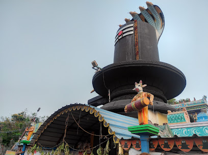

# Ex04 Places Around Me
## Date: 
14/12/24
## AIM
To develop a website to display details about the places around my house.

## DESIGN STEPS

### STEP 1
Create a Django admin interface.

### STEP 2
Download your city map from Google.

### STEP 3
Using ```<map>``` tag name the map.

### STEP 4
Create clickable regions in the image using ```<area>``` tag.

### STEP 5
Write HTML programs for all the regions identified.

### STEP 6
Execute the programs and publish them.

## CODE
```
<!DOCTYPE html>
<html lang="en">
<head>
    <meta charset="UTF-8">
    <title>Thiruvallur Map</title>
</head>
<body>
    <h1>Clickable Map of Thiruvallur</h1>
    <p>Hover over the regions and click to explore more about Thiruvallur.</p>

  <!-- Image Map Generated by http://www.image-map.net/ -->


<map name="image-map">
    <area target="_self" alt="Sri sivan temple" title="Sri sivan temple" href="loc1.html" coords="562,483,809,545" shape="rect">
    <area target="_self" alt="GRT Jewellers" title="GRT Jewellers" href="loc2.html" coords="903,321,1064,400" shape="rect">
    <area target="_self" alt="Govt.Hospital" title="Govt.Hospital" href="loc3.html" coords="819,147,1024,195" shape="rect">
    <area target="_self" alt="Berachah fashions" title="Berachah fashions" href="loc4.html" coords="1120,321,1357,371" shape="rect">
    <area target="_self" alt="Euro Pre-School" title="Euro Pre-School" href="loc5.html" coords="1620,131,1825,199" shape="rect">
</map>
</body>
</html>
```
```
<!DOCTYPE html>
<html>
<head>
</head>
<body>
    <h1>Aadi Nagaresvar Temple</h1>

    <!-- Display an image -->
    

    <!-- Text below the image -->
    <p>Sri sivan Temple is a Shiva temple situated in manvala nagar, a suburb of Thiruvallur. The temple was built during the Pallava reign and was repaired and rebuilt during the Chola reign.</p>

</body>
</html>
```
```
<!DOCTYPE html>
<html>
<head>
</head>
<body>
    <h1>GRT Jewellers</h1>

    <!-- Display an image -->
    

    <!-- Text below the image -->
    <p>GRT Jewellers Experience Timeless Value of Gold with Our Online Gold Coin Shop. Buy 24 Carat Gold Coins. Shop From Exclusive Designs of Gold Jewellery.</p>

</body>
</html>
```
```
<!DOCTYPE html>
<html>
<head>
</head>
<body>
    <h1>Govt.Hospital</h1>

    <!-- Display an image -->
    

    <!-- Text below the image -->
    <p>A public hospital, or government hospital, is a hospital which is government owned and is predominantly funded by the government and operates predominantly off the money that is collected from taxpayers to fund healthcare initiatives.</p>

</body>
</html>
```
```
<!DOCTYPE html>
<html>
<head>
</head>
<body>
    <h1>Berachah fashions</h1>

    <!-- Display an image -->
    

    <!-- Text below the image -->
    <p>A clothes shop or clothes store is any shop which sells items of ready-made clothing. A small shop which sells expensive or designer clothing may be called a boutique. A shop that sells clothes for a narrowly-restricted market such as school uniforms or outdoor sports may be called an outfitter.</p>

</body>
</html>
```
```
<!DOCTYPE html>
<html>
<head>
</head>
<body>
    <h1>Euro Pre-School</h1>

    <!-- Display an image -->
    

    <!-- Text below the image -->
    <p>EuroSchool provides ICSE and CBSE board education through its 11 co-educational campuses across Mumbai suburban (Thane and Navi Mumbai's Airoli), Bengaluru (Whitefield, North Campus and Chimney Hills), Pune (Undri and Wakad and West Wakad), Hyderabad (GachiBowli), Ahmedabad and Surat.</p>

</body>
</html>
```

## OUTPUT


## RESULT
The program for implementing image maps using HTML is executed successfully.
